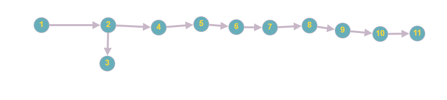

# Karatsuba
O algoritmo de Karatsuba é uma técnica eficiente para multiplicação de números
inteiros grandes, introduzida por Anatolii Karatsuba em 1960. Ele melhora a
complexidade da multiplicação em comparação ao método tradicional de
multiplicação direta.

## Complexidade Ciclomática
    
- Definição: Mede a quantidade de caminhos independentes em um código-fonte, refletindo sua complexidade lógica. É uma métrica usada na engenharia de software para avaliar a testabilidade e a manutenção do código.
- Finalidade: Determinar a quantidade mínima de casos de teste necessários para garantir que todos os caminhos do código sejam executados ao menos uma vez.
- Cálculo: Baseia-se no grafo de fluxo de controle do programa: 
    M = E - N + 2P

            Onde:
    
            E: número de arestas (transições entre blocos de código),
            N: número de nós (blocos de código),
            P: número de componentes conectados (geralmente 1 para um único programa).

## Complexidade Assintótica

- Definição: Mede o comportamento de um algoritmo em relação ao aumento do tamanho da entrada (𝑛).Avalia como o tempo de execução ou o uso de memória cresce conforme a entrada aumenta.
- Finalidade: Determinar a eficiência do algoritmo em termos de desempenho temporal (tempo de execução) e espacial (uso de memória).
- Notação: Usa notações como Big-O (𝑂), Omega (Ω) e Theta (Θ) para descrever os limites superiores, inferiores e exatos do crescimento.
- Exemplo: Um algoritmo de busca linear em uma lista de tamanho 𝑛 tem complexidade temporal 𝑂(𝑛), enquanto um algoritmo de busca binária tem 𝑂(log 𝑛).
- Foco: Eficiência de execução e escalabilidade do algoritmo.

## Diferença entre Complexidade Assintótica e Complexidade Ciclomática

A complexidade assintótica refere-se ao comportamento de um algoritmo à medida que a entrada aumenta, enquanto a complexidade ciclomática mede a complexidade do código de um programa com base no número de caminhos lineares independentes no código. A complexidade ciclomática é útil para determinar a quantidade de testes necessários para garantir a cobertura adequada do código.

## Como rodar o projeto

Instalar a última versão do python disponível em: https://www.python.org/downloads/

Necessário rodar o seguinte comando no terminal:
```bash
https://github.com/yancota/Karatsuba.git
```

Rodar o seguinte comando no terminal:
```bash
python main.py
```

## Versão do Python
Este projeto foi desenvolvido na versão 3.13.2 do Python.

## Explicação das funções

### Arquivo: main.py

- **Objetivo:** Este arquivo principal configura e executa a análise de complexidade de diferentes funções.
- **Descrição das funções:**

#### `karatsuba(x, y)`
- Método eficiente para multiplicar números grandes de forma recursiva utilizando entradas aleatórias.
- **Parâmetros:**
  - `x`: Primeiro valor inserido pelo usuário;
  - `y`: Segundo valor inserido pelo usuário.
- **Retorno:**
  - Resultado da multiplicação (ex.: Resultado da multiplicação karatsuba: 500).

## Saída da Execução

```
Digite um número: 50
Digite outro número: 100
Resultado da multiplicação karatsuba: 5000
```

# Análise da complexidade ciclomática
## Fluxo de controle da função
1. Início da função;
2. Verificação do if: Se x < 10 ou y < 10, retorna x * y;

    if true: Retorna o valor da multiplicação simples;

3. Define o tamanho n e cálculo de m;
4. Divisão dos números x e y em partes maiores e menores;
5. Chamadas recursivas:

    x1 = karatsuba(menor, menor2)
    x2 = karatsuba(menor + maior, menor2 + maior2)
    x3 = karatsuba(maior, maior2)

6. Cálculo e combinação dos resultados;
7. Retorno do resultado final;
8. Fim da execução.

## Estruturar o grafo de fluxo (nós e arestas)
### Nós do Grafo (N):
N1: Início da função.

N2: Verificação do primeiro if (x < 10 or y < 10?).

N3: Retorno da multiplicação (return x * y).

N4: Cálculo do tamanho n (n = max(len(str(x)), len(str(y)))).

N5: Cálculo do tamanho m (m = n // 2).

N6: Primeira divisão em partes (maior, menor = divmod(x, 10**m)).

N7: Segunda divisão em partes (maior2, menor2 = divmod(y, 10**m)).

N8: Primeira chamada recursiva (x1 = karatsuba(menor, menor2)).

N9: Segunda chamada recursiva (x2 = karatsuba(menor + maior, menor2 + maior2)).

N10: Terceira chamada recursiva (x3 = karatsuba(maior, maior2)).

N11: Retorno final do valor calculado.

Total de nós: N = 11.

### Arestas do Grafo (E):
N1 → N2: Do início para a verificação do if.

N2 → N3: Se x < 10 ou y < 10 for verdadeiro, retorna x * y.

N2 → N4: Se x e y forem grandes, prossegue para calcular n.

N4 → N5: Cálculo de n para cálculo de m.

N5 → N6: Cálculo de m para a primeira divisão.

N6 → N7: Cálculo da primeira divisão para a segunda divisão.

N7 → N8: Cálculo da segunda divisão para a primeira chamada recursiva.

N8 → N9: Primeira chamada recursiva para a segunda chamada recursiva.

N9 → N10: Segunda ra chamada recursiva para a terceira chamada recursiva.

N10 → N11: Terceira chamada recursiva para retorno dos resultados.

Total de arestas: E = 10.

### Desenho do grafo



### Complexidade Ciclomática: 𝑀 = 𝐸 − 𝑁 + 2𝑃
𝐸: Número de arestas no grafo.

𝑁: Número de nós no grafo.

𝑃: Número de componentes conexos no grafo.

Substituindo: M = 10 - 11 + 2(1) -> M = 1

### Complexidade Assintótica
#### Complexidade Temporal
1. O algoritmo divide os números em duas partes de tamanho 𝑚 = 𝑛 / 2m = n / 2.

2. Realiza três chamadas recursivas:
    x1 = karatsuba(menor,menor2)
    x2 = karatsuba(menor+maior,menor2+maior2)
    x3 = karatsuba(maior,maior2)

3. Além das chamadas recursivas, há operações de soma e deslocamento (O(n))

A recorrência é dada por:

    T(n)=3T(n/2)+O(n)
    
Utilizando o Teorema Mestre: (T(n)=aT(n/b)+O(n^d)) 

    a=3 (três chamadas recursivas),
    b=2 (tamanho reduzido pela metade a cada passo),
    d=1 (operações fora da recursão são O(n)).

Pelo Teorema Mestre, o caso dominante é O(n^log 3 na base 2)

#### Complexidade Espacial

A complexidade espacial do algoritmo é dominada pela profundidade da recursão. Como cada chamada divide o problema ao meio, a profundidade da recursão é 𝑂(log 𝑛).

Melhor Caso, Caso Médio e Pior Caso:
    Melhor Caso: Ocorre quando um dos números é pequeno (O(1)).
    Caso Médio: Segue a recorrência e mantém O(n^log 3 na base 2)
    Pior Caso: Ocorre para números grandes, seguindo O(n^log 3 na base 2).


  


